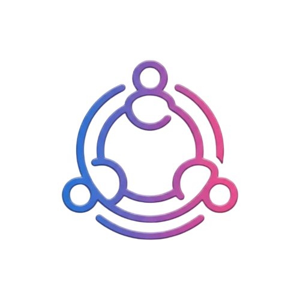
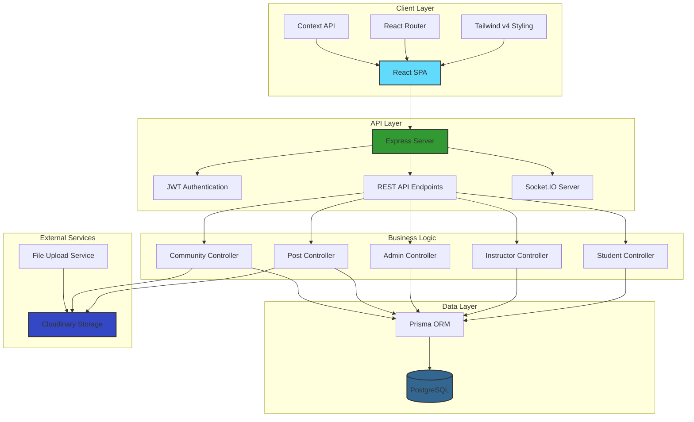
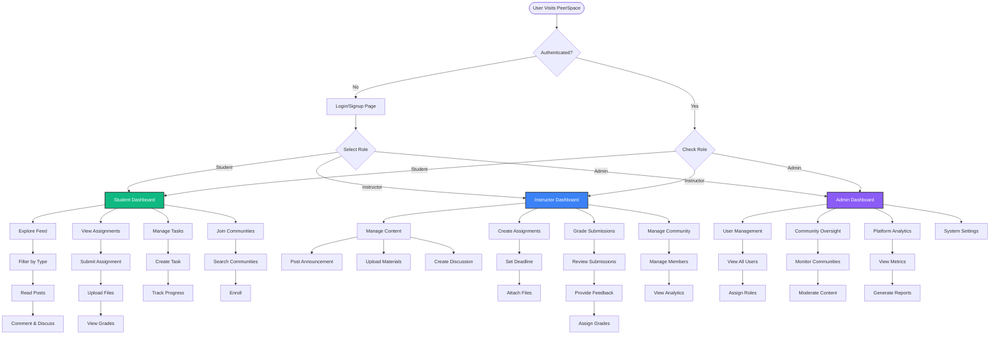
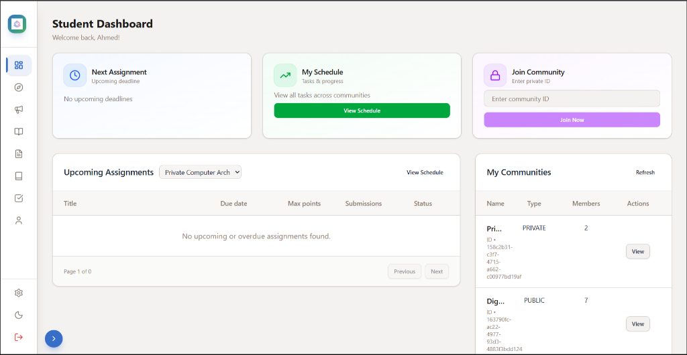
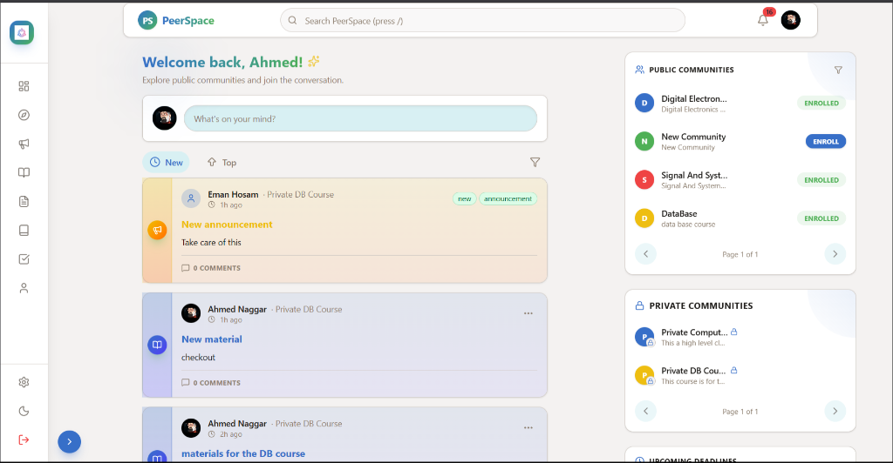
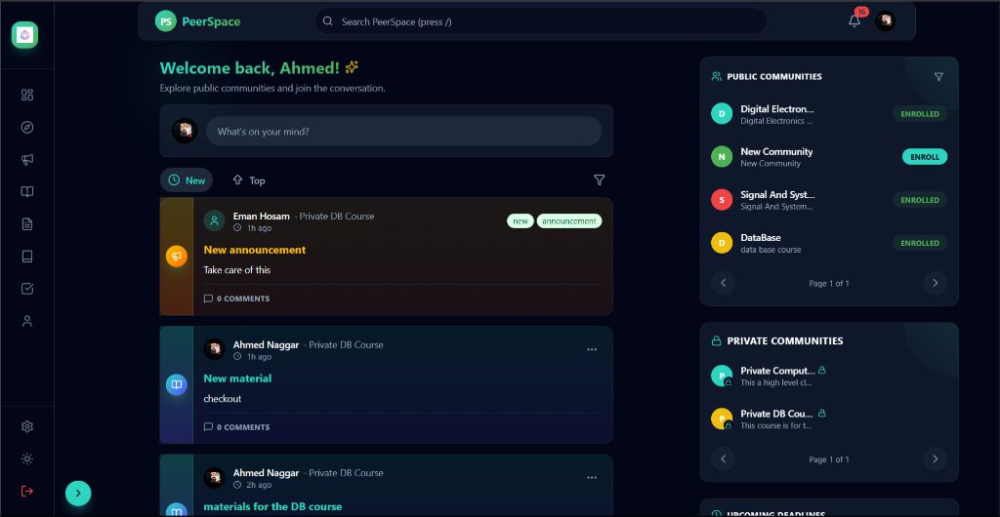

# 🎓 PeerSpace

### *The Modern Academic Collaboration Platform*

**Empowering students, instructors, and administrators with seamless communication, intelligent content management, and real-time collaboration.**

---

## 🌟 Overview

**PeerSpace** is a next-generation learning management platform designed to bridge the gap between students, instructors, and administrators. With a focus on performance, accessibility, and delightful user experience, PeerSpace transforms traditional educational workflows into modern, efficient, and engaging interactions.

---

## 🏗️ System Architecture

---

## 👥 User Flow Diagram

---

## 🚀 Feature Matrix

<table>
<tr>
<th width="33%">👨‍🎓 Students</th>
<th width="33%">👨‍🏫 Instructors</th>
<th width="33%">👨‍💼 Administrators</th>
</tr>
<tr>
<td valign="top">

**Explore & Learn**
- 📚 Interactive feed with post-type filtering
- 📥 Material downloads & document viewer
- 📢 Filtered announcements feed
- 🔍 Mutual community discovery
- 💬 Threaded discussions with approval system

**Assignments & Tasks**
- 📝 Assignment submission with file uploads
- ✅ Personal task management
- 📊 Grade tracking & dashboard
- 🏆 Achievement badges

**Social & Community**
- 👥 User profiles with avatars
- 🔗 Community enrollment
- 💡 Comment & reply system
- 🎯 Mutual connection search

</td>
<td valign="top">

**Content Management**
- 📢 Announcement creation & distribution
- 📚 Material uploads & organization
- 📝 Post creation (Discussions, Materials, Announcements)
- 🗂️ File management with Cloudinary

**Teaching Tools**
- 📊 Dashboard analytics & insights
- 📝 Assignment creation & management
- ✍️ Grading flow with feedback
- 👨‍🎓 Student submission review

**Community Control**
- 🏫 Community management dashboard
- 📈 Unresolved posts tracking
- ✅ Comment approval system
- 📋 Enrollment management

</td>
<td valign="top">

**Platform Oversight**
- 👥 User management (CRUD)
- 🏫 Community management
- 📊 Global analytics dashboard
- 🔍 Advanced search & filtering

**System Administration**
- 📝 Post moderation tools
- 🔐 Role assignment
- 📋 Activity logs
- 🛡️ Security settings

**Reporting**
- 📈 Platform-wide metrics
- 👨‍🎓 User statistics
- 📚 Content analytics
- 🎯 Engagement tracking

</td>
</tr>
</table>

---

## 🛠️ Tech Stack

### Frontend
- **Framework**: React 19.2 + TypeScript
- **Styling**: Tailwind CSS v4 with custom design system
- **Routing**: React Router v7
- **State Management**: React hooks + Context API
- **UI Components**: Radix UI primitives
- **Rich Text**: TipTap editor with Markdown support
- **Notifications**: Sonner toast system
- **Icons**: Lucide React
- **Charts**: Recharts
- **Build Tool**: Vite 7

### Backend
- **Runtime**: Node.js 20+
- **Framework**: Express 5
- **Database**: PostgreSQL with Prisma ORM
- **Authentication**: JWT with refresh tokens
- **File Storage**: Cloudinary
- **Real-time**: Socket.IO
- **API Docs**: Swagger/OpenAPI
- **Security**: bcrypt, CORS, rate limiting

---

## 🚀 Live Demo

**Experience PeerSpace now!**

🌐 **[Visit PeerSpace](https://peer-space-mocha.vercel.app)**

---

## 🤝 Meet the Team

<table>
<tr>
<td align="center" width="200">

 
<b>Ahmed Elnaggar</b>

 
<a href="https://github.com/The-Naggar">GitHub</a>
</td>
<td align="center" width="200">

 
<b>Ahmed Wagih</b>

 
<a href="https://github.com/Ahmed-WaGiiH">GitHub</a>
</td>
<td align="center" width="200">

 
<b>Abdelrahaman Elbana</b>

 
<a href="https://github.com/A-Elbana">GitHub</a>
</td>
<td align="center" width="200">

 
<b>Ahmed Kamal</b>

 
<a href="https://github.com/Ahmed-Mahmoud-Kamal">GitHub</a>
</td>
</tr>
</table>

---

## 📸 Screenshots

<b>🖼️ Click to view screenshots</b>

### Student Dashboard

### Explore Feed - Light Mode

### Explore Feed - Dark Mode

---

## 🤝 Contributing

We love contributions! Please read our [Contributing Guide](./CONTRIBUTING.md) before submitting a Pull Request.

### Development Workflow

1. Fork the repository
2. Create your feature branch (`git checkout -b feature/AmazingFeature`)
3. Commit your changes (`git commit -m 'Add some AmazingFeature'`)
4. Push to the branch (`git push origin feature/AmazingFeature`)
5. Open a Pull Request

---

## 📄 License

This project is licensed under the MIT License - see the [LICENSE](./LICENSE) file for details.

---

## 🙏 Acknowledgments

- [Tailwind CSS](https://tailwindcss.com/) for the amazing styling framework
- [Radix UI](https://www.radix-ui.com/) for accessible component primitives
- [Prisma](https://www.prisma.io/) for the elegant database toolkit
- [Cloudinary](https://cloudinary.com/) for media management
- The open-source community for inspiration and support

---

**Made with ❤️ by the PeerSpace Team**

[⭐ Star us on GitHub](https://github.com/A-Elbana/peerspace) • [🐛 Report Bug](https://github.com/A-Elbana/peerspace/issues) • [✨ Request Feature](https://github.com/A-Elbana/peerspace/issues)

